# Blob Checkpoint Latency

A sample C# Azure Function demonstrating latency of blob storage metadata writes vs Redis Cache writes.

The HTTP Triggered Azure Function performs 2 simple write operations; one in blob storage and one in Redis Cache. An application insights resource is setup to collect write operations latency.

The sample also includes the `Invoke-MainFunction.ps1` Powershell script to call the HTTP Endpoint of the Azure function multiple times.

This example is discussed in [Blob Checkpoint Latency, So Bad ?](http://blog.techdominator.com/article/blob-checkpoint-latency-so-bad.html)

## Pre-Requisites
- [Visual Studio 2026](https://visualstudio.microsoft.com/downloads/) or Alternatively [VS Code](https://code.visualstudio.com/) with the [C# Dev Kit Extension](https://marketplace.visualstudio.com/items?itemName=ms-dotnettools.csdevkit)
- [Powershell 7](https://learn.microsoft.com/en-us/powershell/scripting/install/install-powershell?view=powershell-7.5) 
- [Azure CLI](https://learn.microsoft.com/en-us/cli/azure/install-azure-cli?view=azure-cli-latest)
- [Azure Subscription](https://azure.microsoft.com/en-us/pricing/purchase-options/azure-account)
- [Terraform](https://developer.hashicorp.com/terraform/tutorials/azure-get-started/install-cli)

### Redis
- Install [Redis Insights](https://redis.io/insight/) used as a client to interact with the Redis Database

## Setup Overview

The following diagram shows the sample's setup:

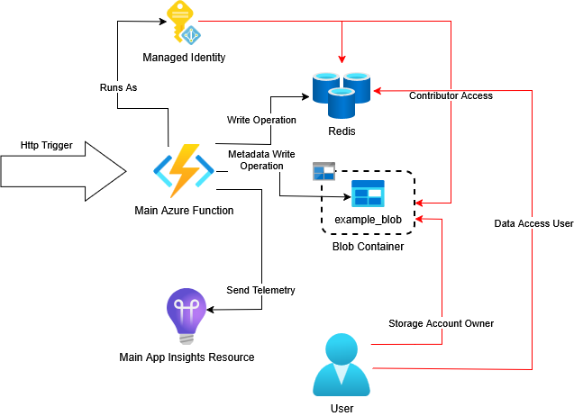

The `Main Azure Function` is triggered with a POST Http request, once triggered it will essentially:
- Write a key/value in the Redis database
- Write in Blob Metadata in the `example_blob` blob

> Note here that we are writing in the metadata of the blob and not the blob itself, this is done to be aligned with the [Eventhub SDK Checkpointing behavior](https://blog.techdominator.com/article/azure-event-hubs-checkpoints-and-rewinding.html#blob-checkpoint-store-structure)

The Azure function collect each write operation's execution time and sends the telemetry to the `Main App Insights Resource`

A Managed Identity is defined and configured to grant data plane access to the Redis database and the storage account blob.

Same access is granted to the main user principal for inspection access.

## Azure Function Overview

The Azure Function measures write latency for Azure Blob Storage and Redis Cache. The function performs the following operations:

1. Connect to Azure Blob Storage using `BlobServiceClient`
2. Write metadata to a blob to simulate Event Hubs checkpoint behavior
3. Connect to Redis Cache using `ConnectionMultiplexer`
4. Write a timestamp key-value pair to Redis
5. Track both operations' latency

The function uses Application Insights dependency tracking to measure execution time for each write operation.

A `DependencyTelemetry` object is created for each of the Blob Storage and Redis operations, capturing the target resource, operation name, and execution duration. 

The `CallWithDependencyTracking` helper method wraps each operation with telemetry collection, handling exceptions and ensuring metrics are flushed to the Application Insights Resource.

## How to use
### 1. Create Azure Resources
Azure Resources for this sample can created via the terraform project under `azure-resources`:
1. `cd azure-resources`
2. `terraform init`
3. `terraform apply -var subscription="<AZURE SUBSCRIPTION ID>" -var userPrincipalId="<USER PRINCIPAL ID>"`

Terraform will ask for confirmation before applying the infrastructure resources.

### 2. Deploy the Function from Visual Studio

Once the azure resources created, deploy the `MainLatencyMeasurementFunction` function to the function app:

1. Open the `AzureEventHubsBlobCheckpointLatency.sln` solution in Visual Studio
1. Right Click on the `AzureEventHubsBlobCheckpointLatency``project and click 'Publish':
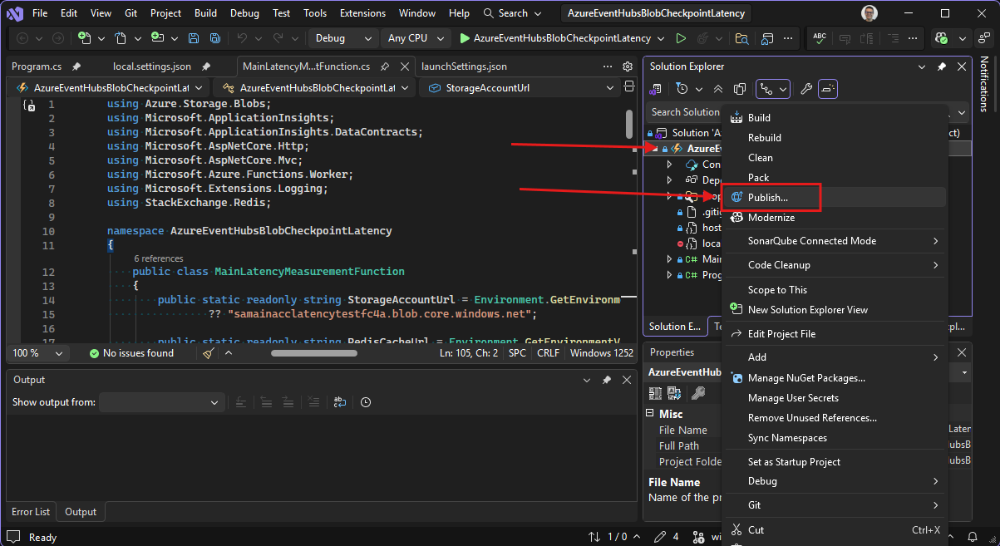
1. In the Publish profiles Window, click on Add a publish profile:
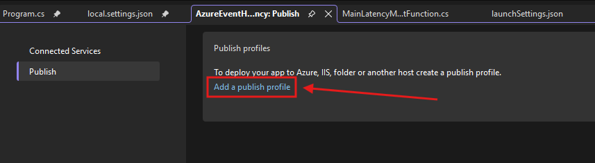
1. In the pop-up Window, select Azure then click next:
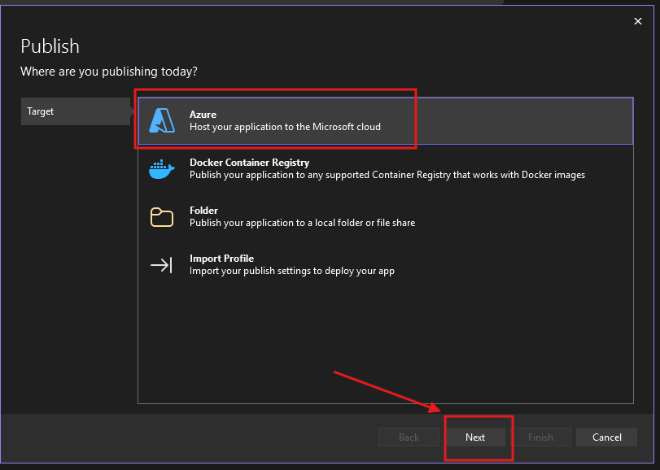
1. Select 'Azure Function App' then click next:
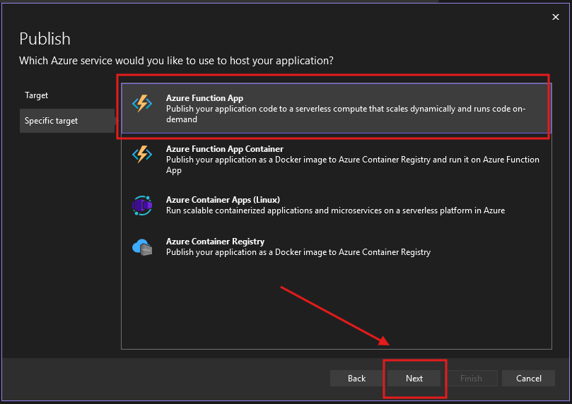
1. Visual Studio will use your account to display existing Function Apps, select the `mainfuncapplatencyb74b` function app then click Next: 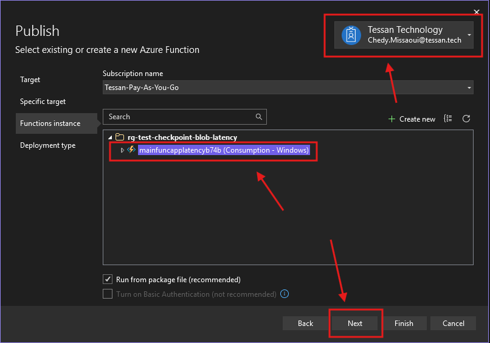
1. Select 'Publish (generates pubxml file)' then click finish:
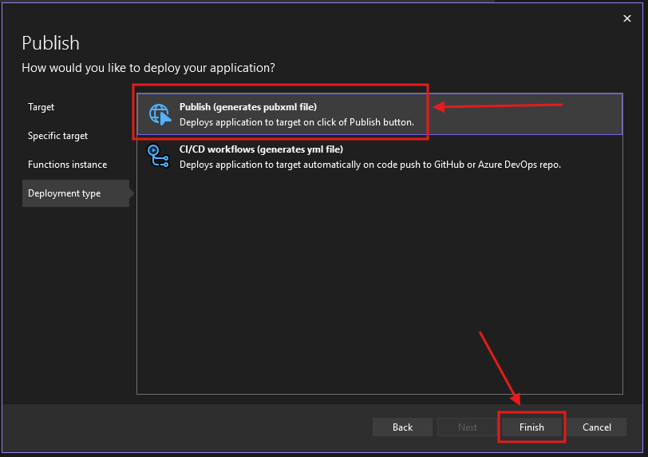
1. Once the publish profile created click on publish to deploy the Function:
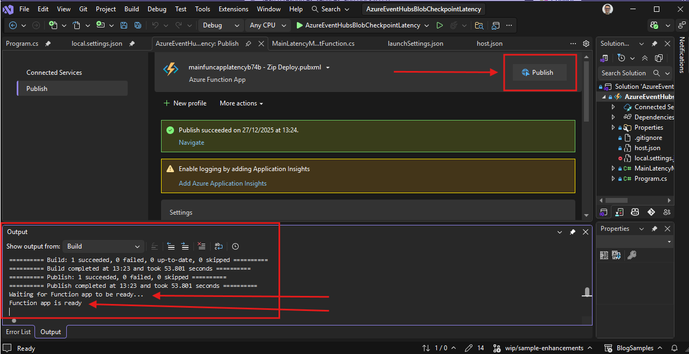

### 3. Setup Redis Insights
To inspect the content of the redis cache in Azure, you can setup are Redis connection on Redis insights:

First, run the `Get-EntraToken.ps1` powershell script to get your user Id and Token which will be used as username and password for the Redis connection:
```
---
User Principal ID: 8eaed7a7-072c-4fbc-91f1-cd13364bdbea
--- 
Token: eyA0eXAiOiJUVIQiLCXhbGciOi*******
---
```

1. Open Redis Insights and Click 'Add Redis database'
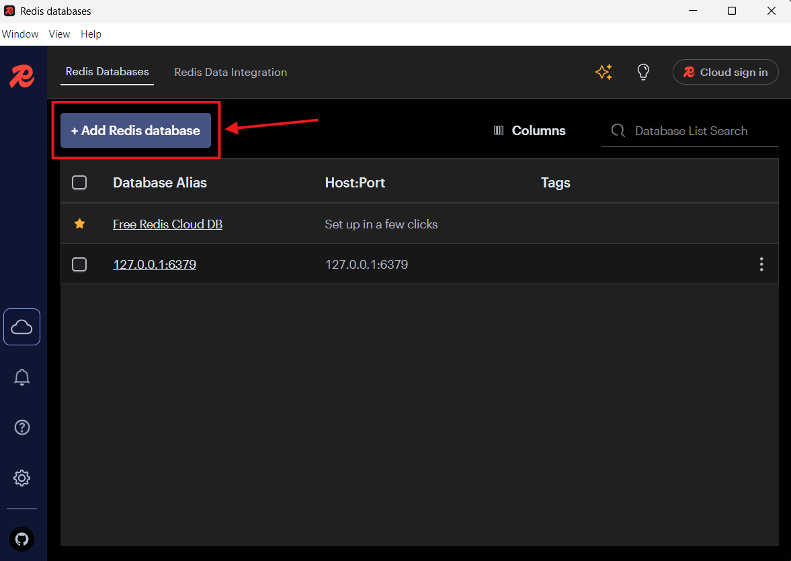

1. In the 'Add Database' pop-up, click on 'Connection Settings':


1. In the General Tab, set the following: Host, Port Username and Password:
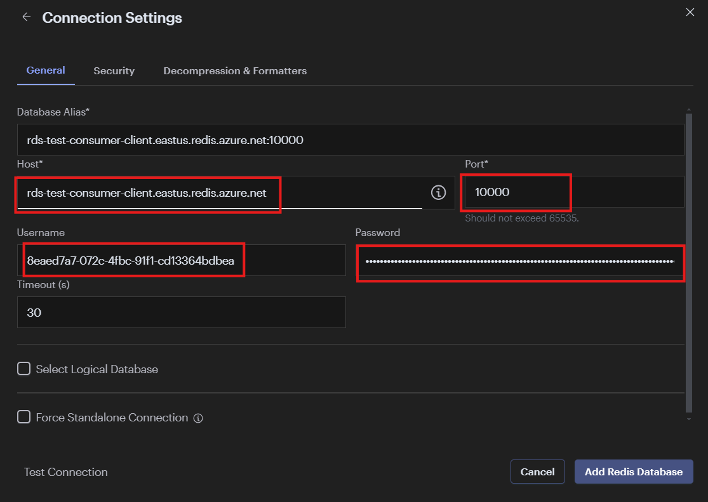

1. In the Security Tab, Enable 'Use TLS' then click on 'Add Redis Database':
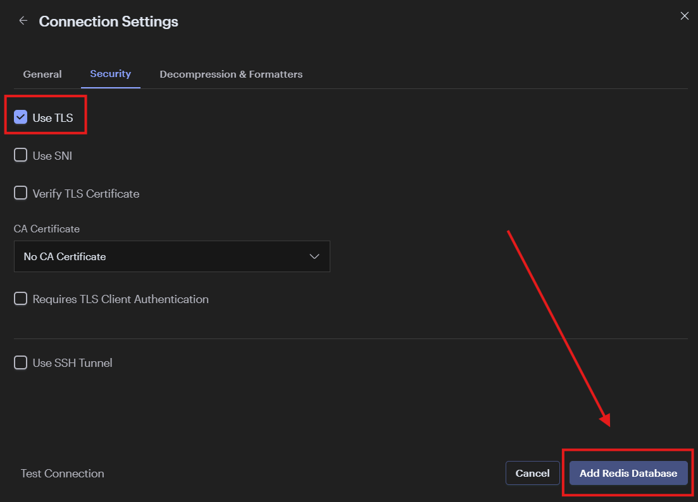

Once configured you can inspect and change key/values available in the redis cache:

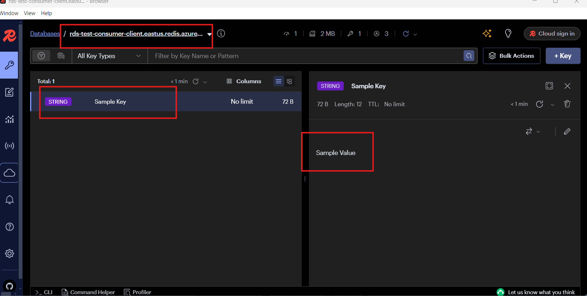

### 4. Call the Main Azure Function

Use the `Invoke-MainFunction.ps1` powershell script to invoke the http trigger multiple times:

```ps1
./Invoke-MainFunction.ps1 `
  -FunctionUrl "https://mainfuncapplatencyb74b.azurewebsites.net/api/MainLatencyMeasurementFunction?code=<REDACTED>" `
  -CallsCount 100
```

You can get the `FunctionUrl` for calling the Azure Function in the Azure Portal or by using the following snippet:

```ps1
$key= az functionapp function keys list --resource-group "rg-test-checkpoint-blob-latency" --name "mainfuncapplatencyb74b" --function-name "MainLatencyMeasurementFunction" --query "default" --output tsv

$urlTemplate=az functionapp function show `
  --resource-group "rg-test-checkpoint-blob-latency" `
  --name "mainfuncapplatencyb74b" `
  --function-name "MainLatencyMeasurementFunction" `
  --query "invokeUrlTemplate" `
  --output tsv

Write-Output "$($urlTemplate)?code=$key"
```

### 5.Visualize Latency Results

Using the [Application Insights Dependency Map](https://learn.microsoft.com/en-us/azure/azure-monitor/app/dependencies?tabs=otel) feature we can easily visualize the latency averages:

1. Go to the Azure portal, select the `rg-test-checkpoint-blob-latency` resource group and navigate to the `rg-test-checkpoint-blob-latency` Application Insights resource:
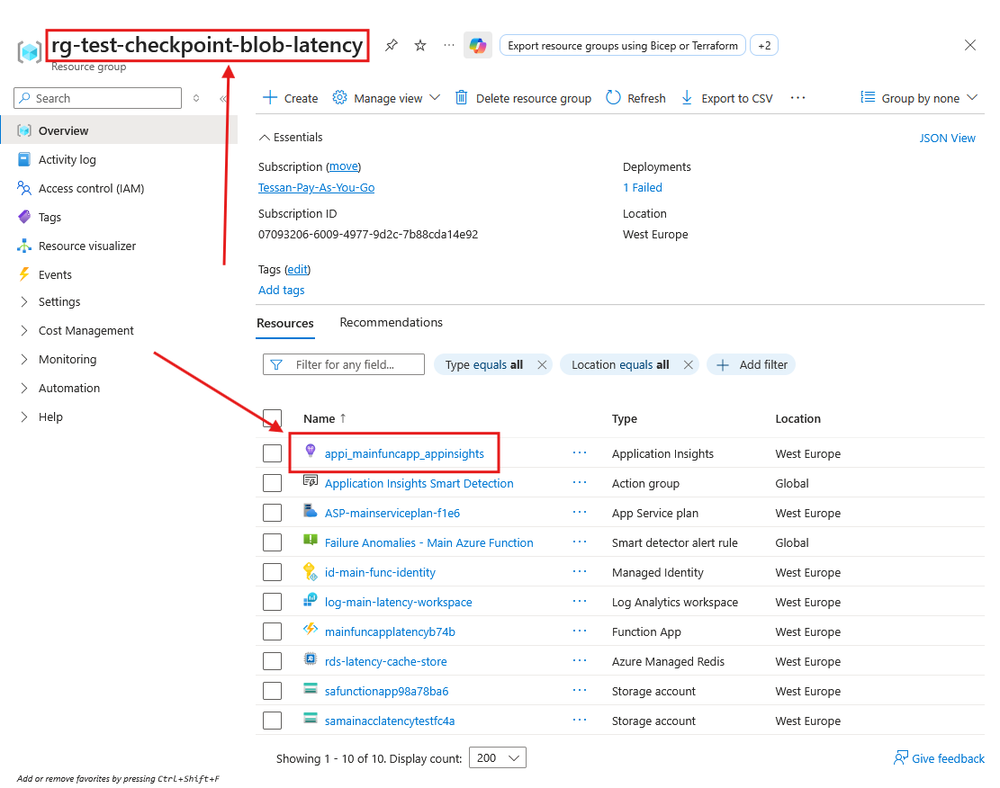
1. Select 'Application Map' in the side pane:
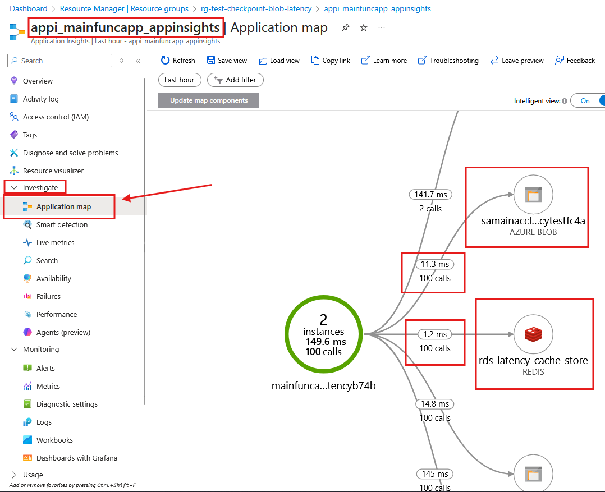

The application map shows latency average numbers for each dependency.

## Notes

### Getting an Access Token for Redis

To generate an access token for connecting to Redis, you can use the `Get-EntraToken.ps1` script. 

This script simplifies the process of obtaining an Azure Active Directory (AAD) token, which is necessary for authenticating with Azure Cache for Redis.

By running the script, you can retrieve a token that can be used with tools like [Redis Insights](https://redis.io/insight/) to manage your Redis instance.

Ensure you have logged in to your Azure account using `az login` before executing the script.

### Azure Resources Cleanup
After finishing using the sample, remember **to remove the azure resources** to avoid incurring unnecessary costs on your Azure Subscription.

This can be done with Terraform by running:
```bash
terraform destroy -var subscription="<AZURE SUBSCRIPTION ID>" -var userPrincipalId="<USER PRINCIPAL ID>"
```

## Contributing

Please checkout [the contribution guidelines](../CONTRIBUTING.md) for contributing.
