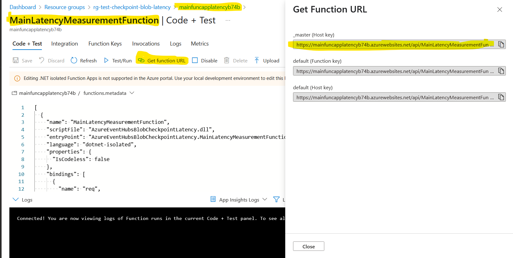

# Blob Checkpoint Latency

A sample C# Azure Function demonstrating latency of blob storage metadata writes vs Redis Cache writes.

This example is discussed in [Blob Checkpoint Latency, So Bad ?](http://blog.techdominator.com/article/blob-checkpoint-latency-so-bad.html)

## Building and running the example

To run the sample you need:

 - [Visual Studio 2022](https://visualstudio.microsoft.com/vs/)
 - [Azure Subscription](https://azure.microsoft.com/en-us/pricing/purchase-options/azure-account)
 - [Terraform](https://developer.hashicorp.com/terraform/install?product_intent=terraform)

You can use the `azure-resources` terraform project to create the required resources.

## Applying the resources via terraform

To create the required resources using Terraform, navigate to the `azure-resources` folder. This folder contains the necessary Terraform configuration files to provision the Azure resources. Follow these steps:

1. Ensure you have [Terraform installed](https://learn.hashicorp.com/tutorials/terraform/install-cli).
1. Open a terminal and navigate to the `azure-resources` folder.
1. Initialize Terraform by running `terraform init`.
1. Review the configuration and make any necessary adjustments to the variables in the `_variables.tf` file.
1. Apply the Terraform configuration by running `terraform apply`.
1. Confirm the apply action when prompted.

Terraform will create the necessary Azure resources as defined in the configuration files. Ensure your Azure credentials are properly configured for authentication by executing an `az login` before running the Terraform commands.

## Deploying the Azure Function to a Function App with Visual Studio

To publish the `mainfuncapplatencyb74b` function to the Function app created as part of the azure resources, please [create a publish profile and us it to deploy the function.](https://learn.microsoft.com/en-us/azure/azure-functions/functions-develop-vs?pivots=isolated#publish-to-azure)

## Calling the Deployed Function

The `Invoke-MainFunction.ps1` powershell script can be used to call the Azure function multiple times, it accepts the following parameters:
- `$FunctionUrl` the http trigger url of the function
- `$CallsCount` the number of calls to make (defaults to 100)

The functions's url can be acquired in the Azure portal:

## Contributing

Please checkout [the contribution guidelines](../CONTRIBUTING.md) for contributing.
