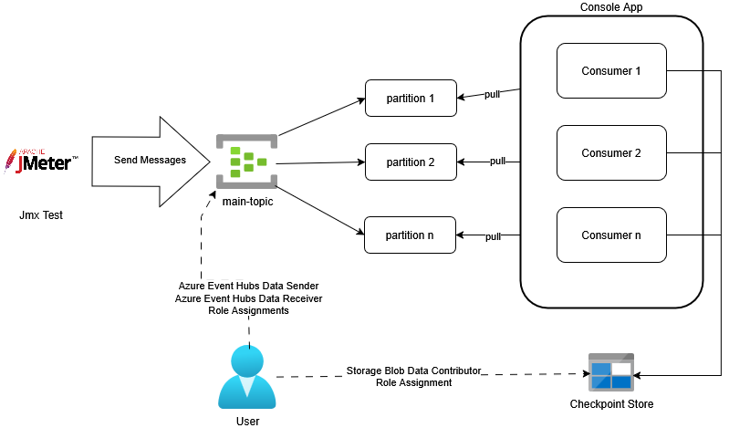
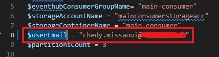
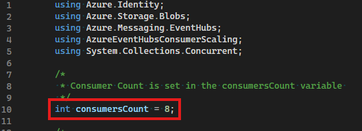
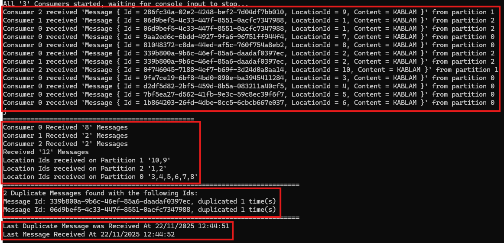

# Azure Event Hub Scaling Event Consumption Sample

A sample C# console app demonstrating how to scale events consumption horizontally based on [Event hub topics partitions.](https://learn.microsoft.com/en-us/azure/event-hubs/event-hubs-features#partitions)

This sample console app is useful for observing how event hub consumers can by scale leveraging partitions.

It can be interesting to experiment how events are dispatched in the following cases:

- number of partitions equal to number of consumers
- number of partitions greater than number of consumers
- number of partitions lesser than number of consumers

This example is discussed in [Scaling Azure Event Hubs Event Consumption](http://blog.techdominator.com/article/scaling-azure-event-hubs-event-consumption.html) blog post.

## Pre-Requisites
- [Visual Studio 2026](https://visualstudio.microsoft.com/downloads/) or Alternatively [VS Code](https://code.visualstudio.com/) with the [C# Dev Kit Extension](https://marketplace.visualstudio.com/items?itemName=ms-dotnettools.csdevkit)
- [Powershell 7](https://learn.microsoft.com/en-us/powershell/scripting/install/install-powershell?view=powershell-7.5) 
- [Azure CLI](https://learn.microsoft.com/en-us/cli/azure/install-azure-cli?view=azure-cli-latest)
- [Azure Subscription](https://azure.microsoft.com/en-us/pricing/purchase-options/azure-account)

### JMeter
1. [Install a Java Runtime Environment](https://www.oracle.com/java/technologies/downloads/) version [recent enough](https://github.com/pnopjp/jmeter-plugins?tab=readme-ov-file#requirements) for the JMeter Eventhub Plugins (Version 17 at the time of this writing)
1. [Download](https://jmeter.apache.org/download_jmeter.cgi) and [Install JMeter Locally](https://www.simplilearn.com/tutorials/jmeter-tutorial/jmeter-installation)
1. [Install the EventHubs JMeter plugin from pnopjp/jmeter-plugins](https://github.com/pnopjp/jmeter-plugins?tab=readme-ov-file#how-to-install)

## Setup Overview

The following diagram depicts the sample's setup:

The `SendMessagesToEventHubTopic.jmx` JMeter test sends a configurable count of messages to the `main-topic` Event Hub.

The Console Application connects to the `main-topic` Event Hub for Consumption, partitions are assigned between the consumers for optimal consumption.

A user's principal is assigned the following roles to allow running the sample without using secrets and by using Entra ID Authentication:
- Azure Event Hubs Data Sender on the `main-topic`
- Azure Event Hubs Data Receiver on the `main-topic`
- Storage Blob Data Contributor on the checkpoint store

## Console App Overview

The console app leverages the Event Hubs SDK to consume messages, it performs the following:

1. Create multiple `EventConsumer` instances starting consumption for each one
1. Waits for user input to stop consumption
1. Once consumption is stopped, it displays event consumption statistics

The `EventConsumer` class is responsible for storing received messages with partition information, making information available for the main program.

## How to use
### 1. Create Azure Resources
The `azure-resources.ps1` powershell script can be used to create the required azure resources:
1. Open a Powershell prompt and `cd AzureEventHubsConsumerScaling`
1. Set the `$userEmail` variable with your azure identity's e-mail

1. Adjust the `main-topic` partition count as desired with the `$partitionsCount` variable
1. Run `az login` to login to the azure subscription
1. Run `./azure-resources.ps1` to create the resources

### 2. Setup JMeter Test 
1. Open JMeter and load the `SendMessagesToEventHubTopic.jmx` test plan.
1. Update the user-defined variables in the test plan with your Event Hub details:
    - `MessagesCount`: Number of messages to send.
    - `TopicName`: Name of your Event Hub topic.
    - `EventHubNamespace`: Your Event Hub namespace.

### 3. Setup Console Application
Under `AzureEventHubsConsumerScaling/Program.cs`, you can configure the consumers count with the `consumersCount` variable:

### 4. Run The Sample
To run the sample:
1. Run the console app by pressing F5 in Visual Studio
1. Run the JMeter Test by pressing the Run Button:

The console app should display the following output with self-explanatory statistics:

## Notes

After finishing using the sample, remember **to remove the resource group** to avoid incurring unnecessary costs on your Azure Subscription.

## Contributing

Please checkout [the contribution guidelines](../CONTRIBUTING.md) for contributing.
