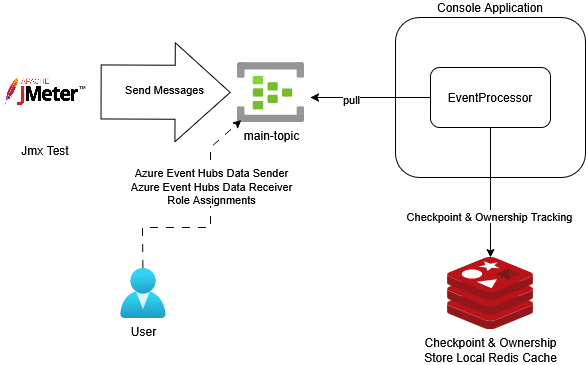
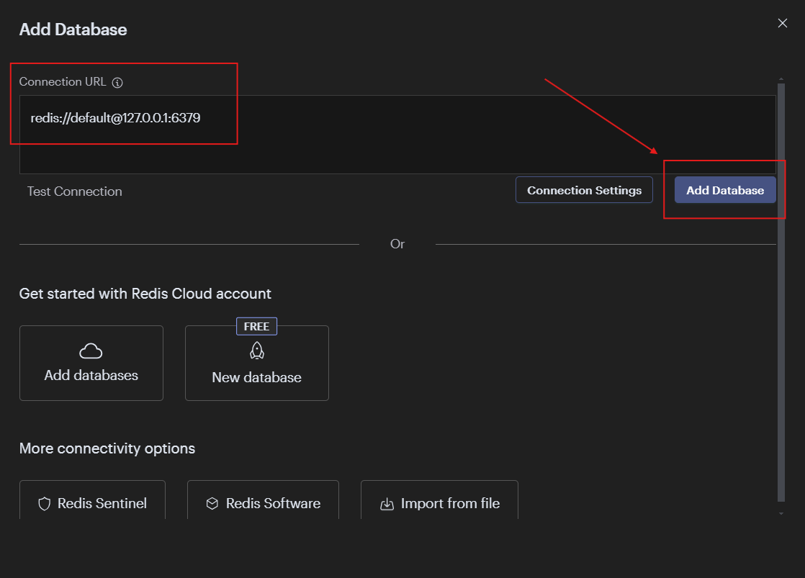
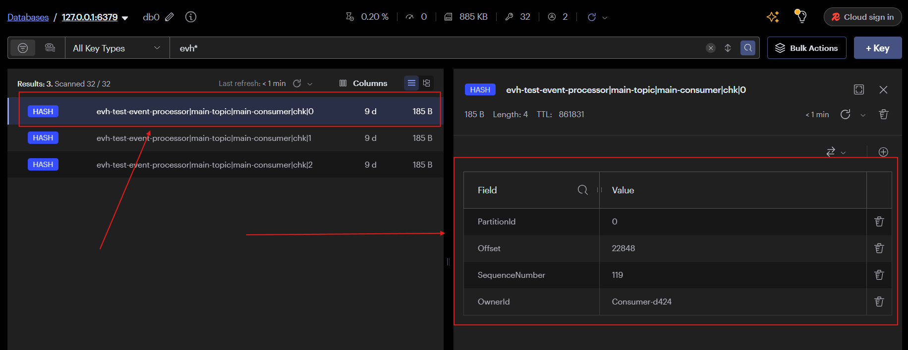
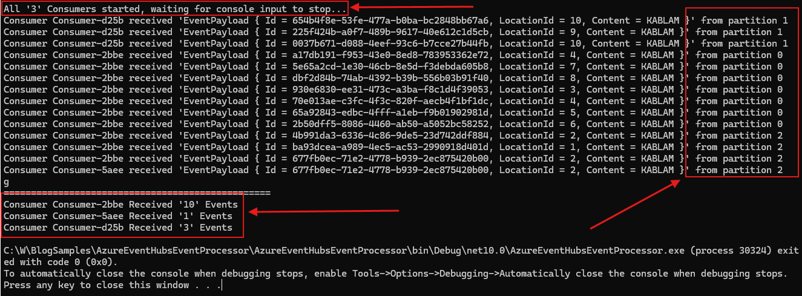

# Azure Event Hub Event Processor Sample

A sample C# console app demonstrating how to use the `EventHubProcessor` class to consume events from several partitions.

The `EventHubProcessor` offers an alternative way to consume messages with the possibility to:
- Customize Partition and Ownership Storage
- Process events by batch

This sample demonstrates how we can use a local [Redis](https://redis.io/) as a checkpoint and partition ownership store. 

This example is discussed in [Azure Event Hubs Event Processor, Yet Another Alternative](http://blog.techdominator.com/article/azure-event-hubs-event-processor,-yet-another-alternative.html)

## Pre-Requisites
- [Visual Studio 2026](https://visualstudio.microsoft.com/downloads/) or Alternatively [VS Code](https://code.visualstudio.com/) with the [C# Dev Kit Extension](https://marketplace.visualstudio.com/items?itemName=ms-dotnettools.csdevkit)
- [Powershell 7](https://learn.microsoft.com/en-us/powershell/scripting/install/install-powershell?view=powershell-7.5) 
- [Azure CLI](https://learn.microsoft.com/en-us/cli/azure/install-azure-cli?view=azure-cli-latest)
- [Azure Subscription](https://azure.microsoft.com/en-us/pricing/purchase-options/azure-account)
- [Terraform](https://developer.hashicorp.com/terraform/tutorials/azure-get-started/install-cli)

### Redis
- Install [Redis Insights](https://redis.io/insight/) used as a client to interact with the Redis Database

If you would like to run a Redis instance locally:
- On Windows:
    - Install [Docker Desktop](https://www.docker.com/products/docker-desktop/) or Alternatively [Rancher Desktop](https://rancherdesktop.io/)
    - Run a Redis instance [in a container](https://redis.io/docs/latest/operate/oss_and_stack/install/install-stack/docker/)
- On Linux:
    - [Install Docker](https://docs.docker.com/engine/install/) then Run a Redis instance in a container
    - Alternatively you can install Redis [Directly on the linux host](https://redis.io/docs/latest/operate/oss_and_stack/install/archive/install-redis/install-redis-on-linux/)

Once Docker installed, you can create an instance by running:

```sh
docker run --name redis-instance -p 6379:6379 -d redis:latest
```

### JMeter
1. [Install a Java Runtime Environment](https://www.oracle.com/java/technologies/downloads/) version [recent enough](https://github.com/pnopjp/jmeter-plugins?tab=readme-ov-file#requirements) for the JMeter Eventhub Plugins (Version 17 at the time of this writing)
1. [Download](https://jmeter.apache.org/download_jmeter.cgi) and [Install JMeter Locally](https://www.simplilearn.com/tutorials/jmeter-tutorial/jmeter-installation)
1. [Install the EventHubs JMeter plugin from pnopjp/jmeter-plugins](https://github.com/pnopjp/jmeter-plugins?tab=readme-ov-file#how-to-install)

## Setup Overview

The following diagram shows the sample's setup:



The `SendMessagesToEventHubTopic.jmx` JMeter test sends a configurable count of messages to the `main-topic` Event Hub.

The Console Application connects to the `main-topic` Event Hub for Consumption, **Checkpoint and Partition Ownership of the event stream is stored in the Redis Instance.**

A user's principal is assigned the following roles to allow running the sample without using secrets and by using Entra ID Authentication:
- Azure Event Hubs Data Sender on the `main-topic`
- Azure Event Hubs Data Receiver on the `main-topic`

## Console App Overview

The console app leverages the Event Hubs SDK to consume messages, to checkpoint event stream and to track partition ownership, it performs the following:

1. Create a Redis connection
1. Create several `CustomEventsProcessor` instances
1. Starts the events processing for `CustomEventsProcessor` instances
1. Once stopped, the program displays count of events processed by each `CustomEventsProcessor` instance

The `CustomEventsProcessor` class inherits from the SDK `EventProcessor` and is responsible for the following:
- Process Events
- Track Partition Ownership
- Track Event Stream Check-pointing for each partition

The `ICheckpointOwnershipStore` interface provides an abstraction for reading and writing checkpoint and ownership information, the `RedisCheckpointOwnershipStore` provides a Redis implementation for `ICheckpointOwnershipStore`

## How to use
### 1. Create Azure Resources
Azure Resources for this sample can created via the terraform project under `azure-resources`:
1. `cd azure-resources`
2. `terraform init`
3. `terraform apply -var subscription="<AZURE SUBSCRIPTION ID>" -var userPrincipalId="<USER PRINCIPAL ID>"`

Terraform will ask for confirmation before applying the infrastructure resources.

### 2. Setup JMeter Test 
1. Open JMeter and load the `SendMessagesToEventHubTopic.jmx` test plan.
1. Update the user-defined variables in the test plan with your Event Hub details:
    - `MessagesCount`: Number of messages to send.
    - `TopicName`: Name of your Event Hub topic.
    - `EventHubNamespace`: Your Event Hub namespace.


### 3. Setup Redis Insights
To inspect the content of the local redis cache, you can setup are Redis connection on Redis insights:

1. Open Redis Insights and Click 'Add Redis database'


1. In the 'Add Database' pop-up, click on 'Add Database':


Once configured you can inspect and change key/values available in the redis cache:



### 4. Setup Console Application
The `AzureEventHubsEventProcessor/Program.cs` is setup by default with resource properties as created by the terraform code under `azure-resources`.

You can adjust the consumers count on the `consumersCount` variable:

```csharp
...

int consumersCount = 3;

...
```
### 5. Run The Sample
To run the sample:
1. Run the console app by pressing F5 in Visual Studio
1. Run the JMeter Test by pressing the Run Button:


The console app should display the following output with events processed and events count processed for each consumer:


## Notes

### Azure Resources Cleanup
After finishing using the sample, remember **to remove the azure resources** to avoid incurring unnecessary costs on your Azure Subscription.

This can be done with Terraform by running:
```bash
terraform destroy -var subscription="<AZURE SUBSCRIPTION ID>" -var userPrincipalId="<USER PRINCIPAL ID>"
```

## Contributing

Please checkout [the contribution guidelines](../CONTRIBUTING.md) for contributing.
