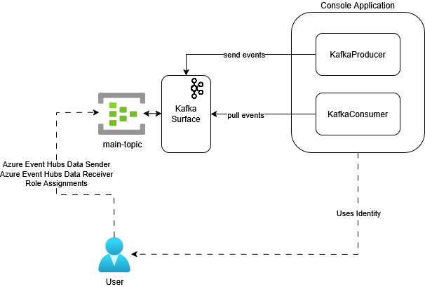
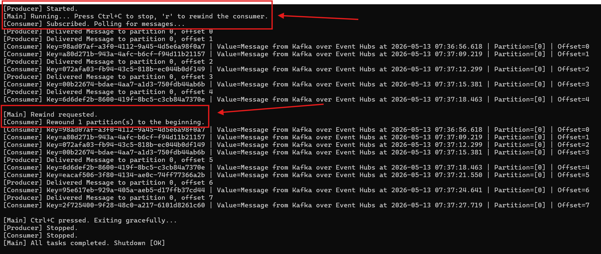

# Azure Event Hubs Kafka Surface Sample

A sample C# console app demonstrating how to use the [Kafka protocol surface of Azure Event Hubs](https://learn.microsoft.com/en-us/azure/event-hubs/azure-event-hubs-apache-kafka-overview) to produce and consume events.

Azure Event Hubs exposes a Kafka-compatible endpoint, making it possible to interact with Event Hubs using any standard Kafka client without modifying application code.

Although Azure Event Hubs is not Kafka, this sample demonstrates how to use the [`Confluent.Kafka`](https://github.com/confluentinc/confluent-kafka-dotnet) client library to produce and consume events through the Kafka surface of Event Hubs, with passwordless authentication via `DefaultAzureCredential`.

This example is discussed in the [Azure Event Hubs Kafka Surface](http://blog.techdominator.com/article/azure-event-hubs-kafka-surface.html) blog post. 

## Pre-Requisites
- [Visual Studio 2026](https://visualstudio.microsoft.com/downloads/) or Alternatively [VS Code](https://code.visualstudio.com/) with the [C# Dev Kit Extension](https://marketplace.visualstudio.com/items?itemName=ms-dotnettools.csdevkit)
- [Powershell 7](https://learn.microsoft.com/en-us/powershell/scripting/install/install-powershell?view=powershell-7.5) 
- [Azure CLI](https://learn.microsoft.com/en-us/cli/azure/install-azure-cli?view=azure-cli-latest)
- [Azure Subscription](https://azure.microsoft.com/en-us/pricing/purchase-options/azure-account)
- [Terraform](https://developer.hashicorp.com/terraform/tutorials/azure-get-started/install-cli)

## Setup Overview
The following diagram shows the sample's setup: 



The console application runs a producer and a consumer concurrently. Both connect to the `main-topic` Event Hub inside the `evh-test-kafka-surface` namespace via the Kafka-compatible endpoint (`<namespace>.servicebus.windows.net:9093`).

Authentication is performed using `DefaultAzureCredential` with the [SASL](https://datatracker.ietf.org/doc/html/rfc4422) OAUTHBEARER mechanism, no connection strings or SAS keys are required.

### Passwordless Authentication via DefaultAzureCredential

In this sample, authentication to Azure Event Hubs is handled through the [`Azure.Identity`](https://learn.microsoft.com/en-us/dotnet/api/azure.identity.defaultazurecredential) library using `DefaultAzureCredential`.

The Kafka client is configured with SASL OAUTHBEARER, and a token refresh handler acquires an Entra ID access token on demand and passes it to the Kafka client.

Terraform assigns the `Azure Event Hubs Data Sender` and `Azure Event Hubs Data Receiver` RBAC roles to your user principal on the `main-topic` Event Hub, so no explicit secrets need to be managed.

Learn more about passwordless authentication for Event Hubs in the [official documentation.](https://learn.microsoft.com/en-us/azure/event-hubs/authorize-access-azure-active-directory)

## Console App Overview
The console app uses the [`Confluent.Kafka`](https://www.nuget.org/packages/Confluent.Kafka/) NuGet package as the Kafka client.

The console app performs the following concurrently:
1. Produces a message to `main-topic` every interval of seconds
1. Consumes and prints messages from `main-topic`, committing offsets explicitly after each message

Both the producer and consumer run until `Ctrl+C` is pressed. Additionally, pressing `r` at any time triggers a consumer rewind, seeking all assigned partitions back to the beginning of the stream.

> Note that for production implementations it is recommended to tune the consumer group and offset management strategy to match your delivery guarantees.

## How to use
### 1. Create Azure Resources
Azure Resources for this sample can be created via the terraform project under `azure-resources`:
1. `cd azure-resources`
2. `terraform init`
3. `terraform apply -var subscription="<AZURE SUBSCRIPTION ID>" -var user_principal_id="<USER PRINCIPAL ID>"`

Terraform will ask for confirmation before applying the infrastructure resources.

### 2. Authenticate via Azure CLI
The console app uses `DefaultAzureCredential`, which picks up your Azure CLI login automatically:

```ps1
az login
```

Ensure the logged-in account is the same principal whose ID was passed to `user_principal_id` during `terraform apply`, so that the RBAC role assignments apply.

### 3. Run The Sample
Run the console app by pressing F5 in Visual Studio or with:

```bash
dotnet run --project AzureEventHubsKafkaSurface
```

The `AzureEventHubsKafkaSurface` console app will start producing and consuming messages. Press `r` to rewind the consumer to the beginning of the stream, or `Ctrl+C` to stop gracefully:



## Notes

### Azure Resources Cleanup
After finishing using the sample, remember **to remove the azure resources** to avoid incurring unnecessary costs on your Azure Subscription.

This can be done with Terraform by running:
```bash
terraform destroy -var subscription="<AZURE SUBSCRIPTION ID>" -var user_principal_id="<USER PRINCIPAL ID>"
```

## Contributing

Please checkout [the contribution guidelines](../CONTRIBUTING.md) for contributing.
