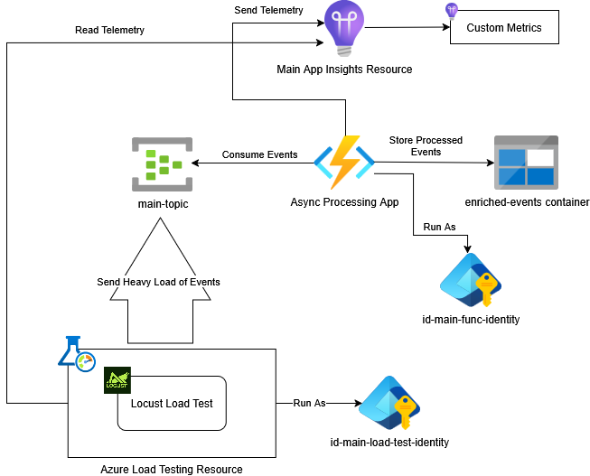
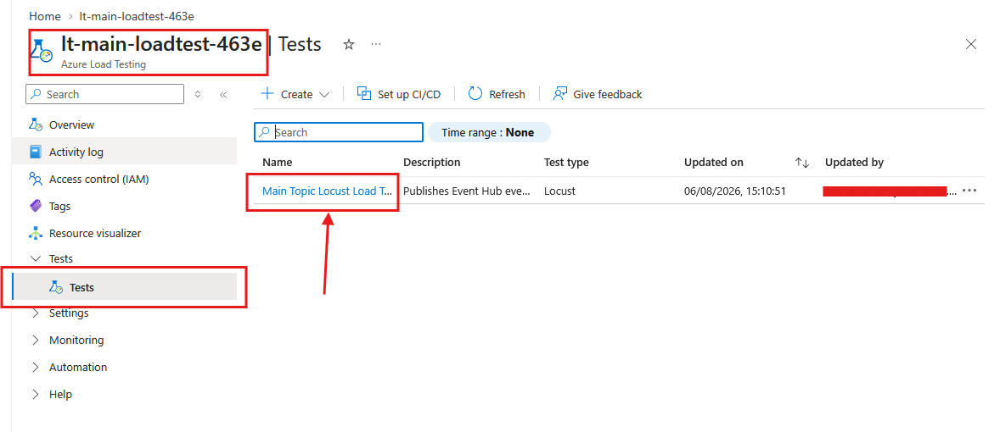
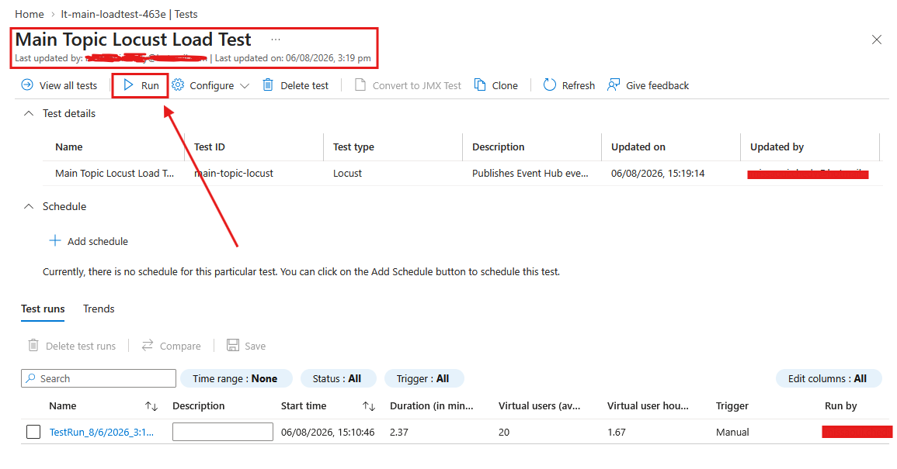
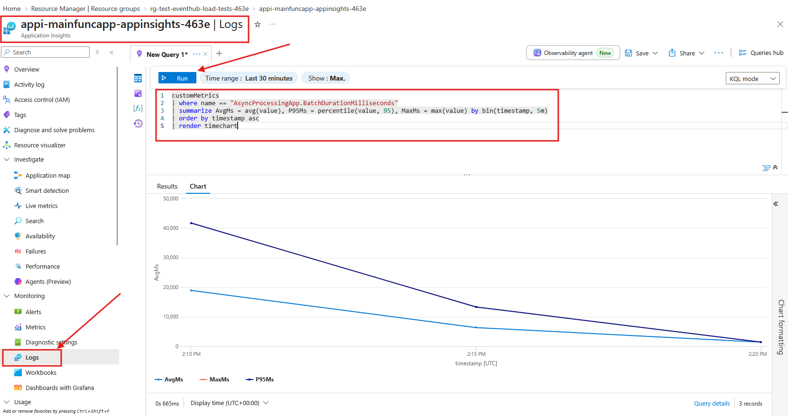
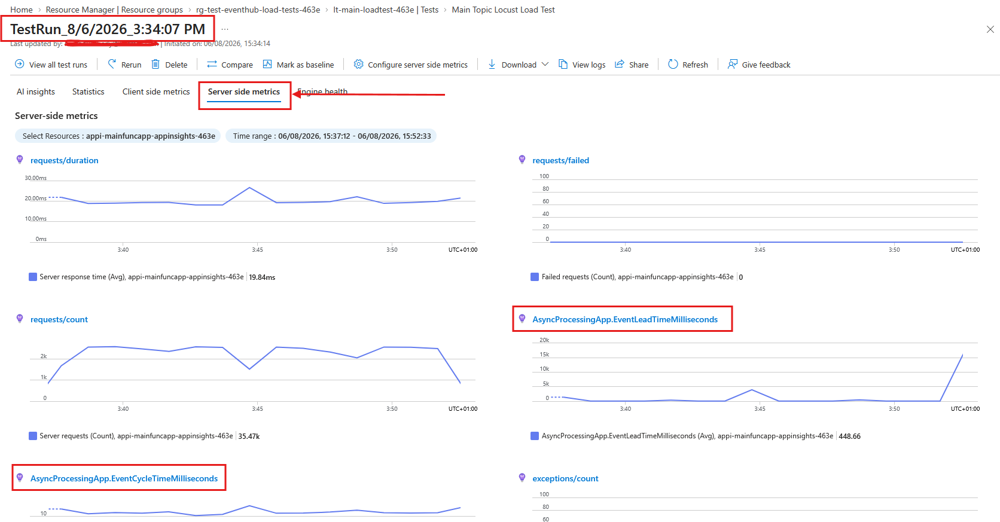
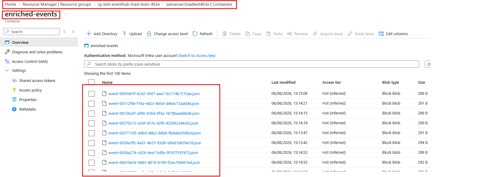

# Azure Event Hubs Locust Load Tests

A sample showing how to load test an **event driven, asynchronous** system with [Locust](https://locust.io/) and [Azure Load Testing](https://learn.microsoft.com/en-us/azure/load-testing/overview-what-is-azure-load-testing), and how to measure custom metrics such as: 
- Event Processing Lead Time
- Event Processing Cycle Time
- Event Queue Lag
- Processing Event Batch size

This example is discussed in the [Load Testing Event Hubs Processing With Locust](http://blog.techdominator.com/article/load-testing-event-hubs-processing-with-locust.html) blog post. 

Load testing a request/response synchronous API is straightforward: you measure the response time of the request.

With an asynchronous pipeline the producer gets an acknowledgment almost immediately, so client side response time tells you nothing about the health of the system.

The interesting numbers live on the consumer side(server side), and they must be correlated with the load the producer generates.

This sample wires the two sides together:

- A **Locust** test plan (`LoadTests/main_load_test.py`) publishes events to an Event Hub with a dedicated `EventHubProducerClient` per virtual user, authenticated with `DefaultAzureCredential`.
- An **Azure Function** (`AsyncProcessingApp`) consumes those events in batches, performs a CPU bound computation, writes an enriched document to Blob Storage, and emits custom pre-aggregated metrics to Application Insights.
- **Azure Load Testing** resource runs the Locust plan on managed engines and pulls the function's server side metrics into the same run report, so client load and server behaviour can be read on a single report.

## Pre-Requisites

- [Visual Studio 2026](https://visualstudio.microsoft.com/downloads/) or alternatively [VS Code](https://code.visualstudio.com/) with the [C# Dev Kit Extension](https://marketplace.visualstudio.com/items?itemName=ms-dotnettools.csdevkit)
- [.NET 10 SDK](https://dotnet.microsoft.com/download)
- [Azure Functions Core Tools](https://learn.microsoft.com/en-us/azure/azure-functions/functions-run-local) (for running the function locally)
- [Python 3.11+](https://www.python.org/downloads/) (for running Locust locally)
- [PowerShell 7](https://learn.microsoft.com/en-us/powershell/scripting/install/install-powershell?view=powershell-7.5)
- [Azure CLI](https://learn.microsoft.com/en-us/cli/azure/install-azure-cli?view=azure-cli-latest) with the `load` [extension](https://learn.microsoft.com/en-us/cli/azure/azure-cli-extensions-overview?view=azure-cli-latest#install-extensions-manually)
- [Terraform](https://developer.hashicorp.com/terraform/tutorials/azure-get-started/install-cli)
- [Azure Subscription](https://azure.microsoft.com/en-us/pricing/purchase-options/azure-account)

## Setup Overview
The following diagram shows the sample's setup: 



The locust test sends a high load of events to the `main-topic` event hub.

The `AsyncProcessingApp` azure function processes events from `main-topic` and stores each resulting enriched event as a block in the `enriched-events` container, the function also report telemetry to the application insights resource.

Everything authenticates with Entra ID, no connection strings or SAS keys are used:

| Principal                                         | Role                                             | Scope                                                    |
|---------------------------------------------------|--------------------------------------------------|----------------------------------------------------------|
| Your user principal                               | `Azure Event Hubs Data Sender` / `Data Receiver` | `main-topic`                                             |
| Your user principal                               | `Storage Blob Data Owner`                        | main storage account                                     |
| Function identity (`id-main-func-identity`)       | `Azure Event Hubs Data Receiver`                 | `main-topic`                                             |
| Function identity                                 | `Storage Blob Data Contributor`                  | `enriched-events` container                              |
| Load test identity (`id-main-load-test-identity`) | `Azure Event Hubs Data Sender`                   | `main-topic`                                             |
| Load test identity                                | `Reader`                                         | Event Hubs namespace, Function App, Application Insights |

## High Level Project Layout

The repository is composed of several sub-projects.

| Path                           | Description                                                                             |
|--------------------------------|-----------------------------------------------------------------------------------------|
| `azure-resources/`             | Terraform project creating every Azure resource used by the sample                      |
| `AsyncProcessingApp/`          | .NET 10 isolated worker Azure Function consuming `main-topic`                           |
| `LoadTests/`                   | Locust test plan and its `requirements.txt`                                             |
| `UtilityScripts/`              | PowerShell helpers to deploy the function, deploy the load test, and run Locust locally |
| `main-topic-event.schema.json` | JSON Schema of the event contract shared by producer and consumer                       |

## The Event Contract

Producer and consumer agree on a single payload, described by `main-topic-event.schema.json`:

```json
{
  "Id": "0f1a3c4e-6c0e-4f2f-9a5d-2b7e0a1c9d33",
  "Content": 137,
  "AreaCode": "EUROPE",
  "CreatedAt": "2026-08-03T09:12:44.512Z",
  "SentAt": "2026-08-03T09:12:44.513Z"
}
```

The `Content` property has an impact on the event processing, the consumer feeds it into `EventProcessor.ComputeComplexity`.

**Raising the `Content` range** in the Locust plan **raises the CPU cost** per event without changing anything else.

`AreaCode` is used as the **partition key** when sending, which both spreads events over the default 4 partitions and becomes a metric dimension on the consumer side, so lead time and cycle time can be sliced per area.

Use `UtilityScripts/New-SampleEvent.ps1` to generate a valid payload from the schema if you need one by hand.

## Load Test Overview

`LoadTests/main_load_test.py` defines a Locust `User` rather than an `HttpUser`, because the "request" is an Event Hubs send, not an HTTP call:

- `on_start` creates a `DefaultAzureCredential` and a dedicated `EventHubProducerClient` per virtual user, `on_stop` closes both.
- Each task iteration builds one schema-compliant event, wraps it in a batch keyed by `AreaCode`, and sends it.
- The elapsed time is reported to Locust manually through `events.request.fire`, with the exception (if any) attached so failures show up in the Locust statistics.

Target namespace and hub are read from the `EVENTHUB_FULLY_QUALIFIED_NAMESPACE` and `EVENTHUB_NAME` environment variables, which is exactly how `Invoke-DeployLoadTests.ps1` parameterizes the cloud run.

> Because the send is asynchronous by nature, the response time Locust reports is the **producer side** cost (batch creation plus the AMQP send), not the end to end processing time. The significant indicators are available in the function's custom metrics.

## Async Processing Function Overview

`AsyncProcessingFunction` is triggered by [`EventHubTrigger`](https://learn.microsoft.com/en-us/azure/azure-functions/functions-bindings-event-hubs-trigger?tabs=python-v2%2Cisolated-process%2Cnodejs-v4%2Cfunctionsv2%2Cextensionv5&pivots=programming-language-csharp) on the `main-consumer` consumer group and receives an `EventData[]` **batch**. Binding to `EventData` rather than a POCO is deliberate: it gives access to `EventData.EnqueuedTime`, a timestamp assigned by the Event Hubs service, which removes the producer clock from the latency calculations.

For each batch the function:

1. Records the batch size and starts the batch timer.
2. For each event: computes queue lag, deserializes, enriches (CPU bound prime computation), uploads a JSON blob to the `enriched-events` container, then records cycle time and lead time with the `AreaCode` dimension.
3. Records the total batch duration.

Batching behaviour is tuned in `host.json`:

```json
"eventHubs": {
  "maxEventBatchSize": 100,
  "prefetchCount": 300,
  "batchCheckpointFrequency": 50,
  "targetUnprocessedEventThreshold": 100
}
```

`targetUnprocessedEventThreshold` is the scaling knob for the Flex Consumption plan: **the lower it is,** the more **aggressively the platform adds instances** when the backlog grows.

## Custom Metrics

`MetricsTracker` uses `TelemetryClient.GetMetric(...)` (pre-aggregation) instead of `TrackMetric`, which keeps telemetry volume flat under load:

| Metric                                          | Meaning                                                                               |
|-------------------------------------------------|---------------------------------------------------------------------------------------|
| `AsyncProcessingApp.BatchSize`                  | Events received in one trigger invocation, a proxy for backlog pressure               |
| `AsyncProcessingApp.QueueLagMilliseconds`       | `ProcessingStartedAt - EnqueuedTime`, how long an event waited before being picked up |
| `AsyncProcessingApp.EventCycleTimeMilliseconds` | `ProcessingEndedAt - ProcessingStartedAt`, the function's own work per event          |
| `AsyncProcessingApp.EventLeadTimeMilliseconds`  | `ProcessingEndedAt - EnqueuedTime`, the end to end latency the consumer observes      |
| `AsyncProcessingApp.BatchDurationMilliseconds`  | Wall clock time to process the whole batch                                            |

Cycle time and lead time carry the `AreaCode` dimension.

The backlog pressure of the pipeline has no direct metric, it is approximated by two of them read together:

- `AsyncProcessingApp.BatchSize`, how many events were read in one trigger invocation.
- `AsyncProcessingApp.QueueLagMilliseconds`, how long events waited in the hub before the invocation started.

### Warning: Clock Skew In Queue Lag And Lead Time

Queue lag and lead time are computed from timestamps produced by two different systems:

- `EventData.EnqueuedTime` is assigned by the Event Hubs service infrastructure.
- `ProcessingStartedAt` and `ProcessingEndedAt` are assigned by the Function host VM clock.

If those clocks drift apart, lag and lead values are skewed, occasionally to the point of producing a negative lag. `MetricsTracker` drops negative queue lag values rather than recording them, but small positive values near zero deserve the same suspicion.

When reading the results:

- Treat very small negative or near-zero lag values as clock noise.
- Prefer percentile trends (p50/p95/p99) over single-point values.
- Correlate lag and lead trends with batch duration and batch size before concluding there is queue pressure.

## Visualizing The Metrics In Application Insights

Open the Function App → Application Insights → Logs, and run the following queries.

### Lead Time And Cycle Time Statistics (p50/p95/p99)

```kusto
customMetrics
| where name in ("AsyncProcessingApp.EventLeadTimeMilliseconds", "AsyncProcessingApp.EventCycleTimeMilliseconds")
| summarize
    AvgMs = avg(value),
    P50Ms = percentile(value, 50),
    P95Ms = percentile(value, 95),
    P99Ms = percentile(value, 99),
    MaxMs = max(value)
  by Metric = name, bin(timestamp, 5m)
| order by timestamp asc
| render timechart
```

### Queue Lag And Batch Size Trend

```kusto
customMetrics
| where name in ("AsyncProcessingApp.QueueLagMilliseconds", "AsyncProcessingApp.BatchSize")
| summarize AvgValue = avg(value), P95Value = percentile(value, 95) by Metric = name, bin(timestamp, 5m)
| order by timestamp asc
| render timechart
```

### Batch Duration Trend

```kusto
customMetrics
| where name == "AsyncProcessingApp.BatchDurationMilliseconds"
| summarize AvgMs = avg(value), P95Ms = percentile(value, 95), MaxMs = max(value) by bin(timestamp, 5m)
| order by timestamp asc
| render timechart
```

## Utility Scripts

All helpers live under `UtilityScripts/`. Run `Get-Help <script>` on any of them for full parameter documentation and examples.

| Script                        | Description                                                                                                            |
|-------------------------------|------------------------------------------------------------------------------------------------------------------------|
| `Invoke-DeployAzFunction.ps1` | Builds, packages, and deploys the Azure Function to Azure via ZIP deployment                                           |
| `Invoke-DeployLoadTests.ps1`  | Creates or updates the Azure Load Testing test, uploads the Locust plan, and attaches server-side App Insights metrics |
| `Start-LocustTest.ps1`        | Activates the Python virtual environment and runs Locust locally, with optional headless mode for CLI/CI runs          |
| `New-SampleEvent.ps1`         | Generates a random valid `main-topic` event payload as JSON, useful for manual testing                                 |

## How To Use

### 1. Authenticate

```ps1
az login
```

Use the same principal whose object ID was passed to `userPrincipalId`, so the RBAC assignments apply to your session.

### 2. Create Azure Resources

```ps1
cd azure-resources
terraform init
terraform apply -var subscription="<AZURE SUBSCRIPTION ID>" -var userPrincipalId="<USER PRINCIPAL ID>"
```

Resource names are suffixed with `local.suffix` (`463e` by default) in `azure-resources/_locals.tf`. Change it to get your own globally unique names, and update the defaults in `UtilityScripts/*.ps1` and `AsyncProcessingApp/local.settings.json` accordingly.

### 3. Deploy The Function

```ps1
./UtilityScripts/Invoke-DeployAzFunction.ps1
```

To run the function locally instead, fill `AZURE_CLIENT_ID` (or leave it empty to use your Azure CLI login) in `AsyncProcessingApp/AsyncProcessingApp/local.settings.json` and start it with `func start` or F5 in Visual Studio. **Local runs still consume from the real Event Hub.**

### 4. Deploy The Load Test

```ps1
./UtilityScripts/Invoke-DeployLoadTests.ps1
```

The script deletes and re-creates the `main-topic-locust` test, uploads `main_load_test.py` as the test plan and `requirements.txt` as an additional artifact, attaches the Application Insights resource as an app component, and registers the server side metrics collected during the run:

- `AsyncProcessingApp.EventLeadTimeMilliseconds` (average)
- `AsyncProcessingApp.EventCycleTimeMilliseconds` (average)
- `exceptions/count` (count)

Run parameters are defined near the bottom of the script (`$EngineInstances = 1`, `$Users = 20`, `$SpawnRate = 5`, `$RunTimeSeconds = 900`) and passed to the engines as environment variables.

You can start the test from the Azure portal:

1. Navigate to the load test resource, then click on the test:

2. Click on run to configure and execute the run:


Or with the following az cli command:

```ps1
az load test-run create `
  --load-test-resource "lt-main-loadtest-463e" `
  --resource-group "rg-test-eventhub-load-tests-463e" `
  --test-id "main-topic-locust" `
  --test-run-id "run-$(Get-Date -Format yyyyMMddHHmmss)"
```

### 5. Run Locust Locally

For fast iteration on the test plan, you can run Locust from your machine:

```ps1
cd LoadTests
python -m venv .venv
./.venv/Scripts/Activate.ps1
pip install -r requirements.txt
```

Then, from anywhere in the repository:

```ps1
./UtilityScripts/Start-LocustTest.ps1 -Users 20 -SpawnRate 5 -RunTimeSeconds 120 -Headless
```

Omit `-Headless` to get the Locust web UI on <http://localhost:8089>. The script activates the virtual environment under `LoadTests/.venv`, so create it there before the first run.

### 6. Read The Results

To review the results, you can:

- Use the kql queries defined in metrics section above in the application insights resource:


- View the configured custom metrics in the Azure Load Tests Test Run:


In addition, you ca inspect the `enriched-events` container to validate that enriched messages are produced and stored:


## Caveats

**This is a demonstration sample, not production code.** Two shortcuts are worth calling out explicitly, because they influence the custom metrics.

**No error handling in the function.** `AsyncProcessingFunction.Run` has no `try`/`catch` and no `CancellationToken`. Under load, one bad payload or one throttled blob write aborts the whole batch, causing duplicated or lost data-points. 
The poison event path is a normal load-test finding: in a real system you would isolate per-event failures, dead-letter the payload, and honour the cancellation token.

**One blob write per event, sequentially awaited in a `foreach`.** This makes the sample storage-latency-bound rather than CPU-bound, and it bakes storage latency into `CycleTime`. 


It is a defensible choice for readability, but it means a user tuning `Content` will wonder why the CPU knob barely moves the curve. If you want the CPU cost to dominate, batch or parallelize the uploads, or replace them with an in-memory sink.

## Notes

### Azure Resources Cleanup

After finishing with the sample, remember **to remove the Azure resources** to avoid incurring unnecessary costs on your subscription:

```ps1
cd azure-resources
terraform destroy -var subscription="<AZURE SUBSCRIPTION ID>" -var userPrincipalId="<USER PRINCIPAL ID>"
```

### Hardcoded Defaults

The PowerShell scripts and `local.settings.json` carry the author's subscription ID and resource names as defaults so the sample can be run with a single command. **You can replace them with your own before running anything.**

## Contributing

Please checkout [the contribution guidelines](../CONTRIBUTING.md) for contributing.