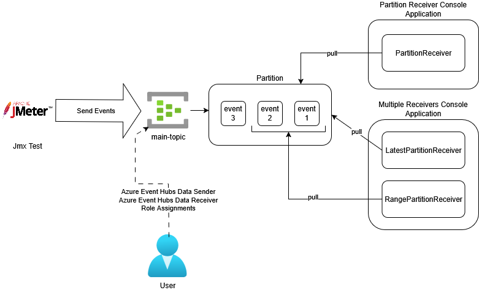
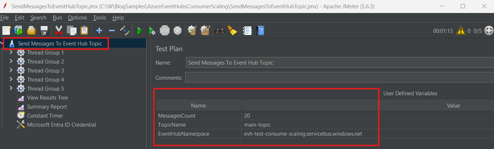
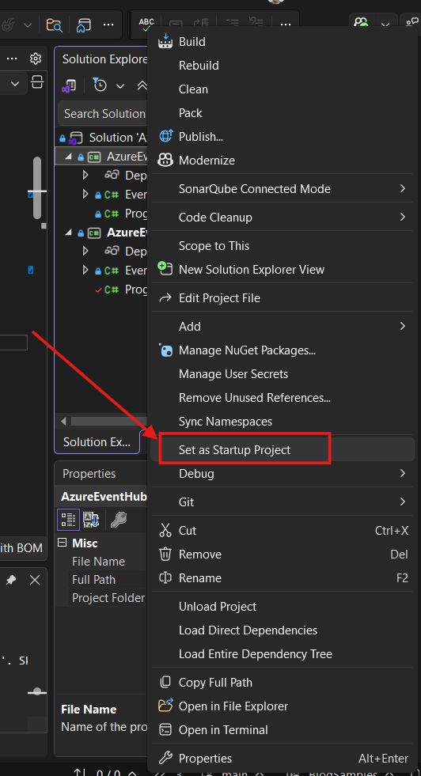
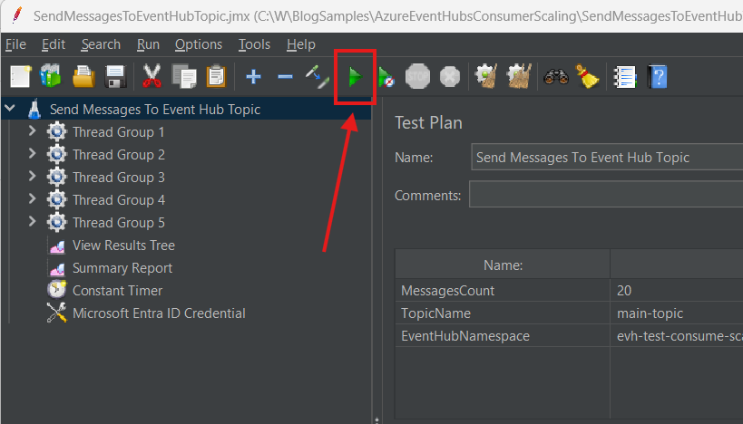
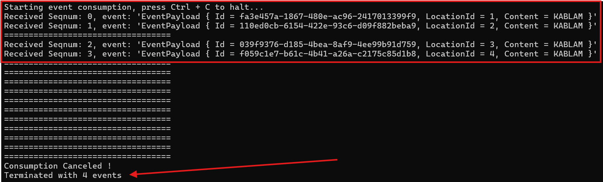
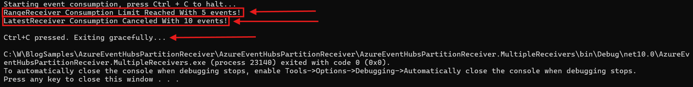

# Azure Event Hubs Partition Receiver Sample

A sample C# console app demonstrating how to use the `PartitionReceiver` to consume events from an event hubs partition, using the Event Hubs SDK.

The `PartitionReceiver` offers an alternative and simple way to consume events from a partition with the following benefits:
- Resource usage predictability
- Possibility to have several `PartitionReceiver` instances consuming events from the same partition

This example is discussed in [Azure Event Hubs Partition Receiver](http://blog.techdominator.com/article/azure-event-hubs-partition-receiver.html)

## Pre-Requisites
- [Visual Studio 2026](https://visualstudio.microsoft.com/downloads/) or Alternatively [VS Code](https://code.visualstudio.com/) with the [C# Dev Kit Extension](https://marketplace.visualstudio.com/items?itemName=ms-dotnettools.csdevkit)
- [Powershell 7](https://learn.microsoft.com/en-us/powershell/scripting/install/install-powershell?view=powershell-7.5) 
- [Azure CLI](https://learn.microsoft.com/en-us/cli/azure/install-azure-cli?view=azure-cli-latest)
- [Azure Subscription](https://azure.microsoft.com/en-us/pricing/purchase-options/azure-account)
- [Terraform](https://developer.hashicorp.com/terraform/tutorials/azure-get-started/install-cli)

### JMeter
1. [Install a Java Runtime Environment](https://www.oracle.com/java/technologies/downloads/) version [recent enough](https://github.com/pnopjp/jmeter-plugins?tab=readme-ov-file#requirements) for the JMeter Eventhub Plugins (Version 17 at the time of this writing)
1. [Download](https://jmeter.apache.org/download_jmeter.cgi) and [Install JMeter Locally](https://www.simplilearn.com/tutorials/jmeter-tutorial/jmeter-installation)
1. [Install the EventHubs JMeter plugin from pnopjp/jmeter-plugins](https://github.com/pnopjp/jmeter-plugins?tab=readme-ov-file#how-to-install)

## Setup Overview

The following diagram shows the sample's setup:



The `SendMessagesToEventHubTopic.jmx` JMeter test sends a configurable count of messages to the `main-topic` Event Hub.

The sample contains 2 console apps:
- `AzureEventHubsPartitionReceiver` contains 1 simple partition receiver that consumes events from the first partition of the `main-topic` Event Hub
- `AzureEventHubsPartitionReceiver.MultipleReceivers` contains 2 partition receivers that consumes events concurrently from the first partition of the `main-topic` Event Hub

The main user's principal is assigned the following roles to allow running the sample without using secrets and by using Entra ID Authentication:
- Azure Event Hubs Data Sender on the `main-topic`
- Azure Event Hubs Data Receiver on the `main-topic`

## Console Apps Overview

### Azure Event Hubs Partition Receiver

The console app leverages the `PartitionReceiver` Event Hubs SDK class to consume events from a specific partition in batch, it performs the following:

1. Create a Partition Receiver Instance
1. Setup the Console App to terminate gracefully on Ctrl+C
1. Inside a loop, use `ReceiveBatchAsync` to receive a batch of `batchSize` events waiting an `eventPullingSpan` time span for the batch to complete
1. Deserialize events of the event batch and display then in the console

### Azure Event Hubs Multiple Partition Receivers

This console app create 2 partition receivers:

- `latestReceiver` consuming latest events on the partition
- `rangeReceiver` consuming a count of events from a given sequence number in a partition

The two partition receivers will consume events concurrently from the designated partition, the console app essentially performs the following:

1. Create the 2 partition receiver instances
1. Setup the Console App to terminate gracefully on Ctrl+C
1. Launches the 2 partition receivers concurrently
1. `latestReceiver` receives the latest events and maintains a count of events received
1. `rangeReceiver` starts consuming from the given sequence number until `countLimit` is reached

You can tweak the `countLimit` and the starting sequence number for the `rangeReceiver`:

```csharp
...
var rangeReceiver = new PartitionReceiver(
   consumerGroup,
    firstParition,
    EventPosition.FromSequenceNumber(30), // starting position
    eventhubNamespace,
    eventhubName,
    new DefaultAzureCredential(),
    new PartitionReceiverOptions()
    {
        Identifier = "RangeReceiver"
    }
);

...
Task[] tasks = [
    Task.Factory.StartNew(() => ReceiveAsync(latestReceiver, cancellationSource).Wait()),
    Task.Factory.StartNew(() => ReceiveWithLimitAsync(
        rangeReceiver,
        cancellationSource,
        countLimit: 50) // Count Limit for Range Event Receiver
    .Wait()),
];
```

## How to use
### 1. Create Azure Resources
Azure Resources for this sample can created via the terraform project under `azure-resources`:
1. `cd azure-resources`
2. `terraform init`
3. `terraform apply -var subscription="<AZURE SUBSCRIPTION ID>" -var userPrincipalId="<USER PRINCIPAL ID>"`

Terraform will ask for confirmation before applying the infrastructure resources.

### 2. Setup JMeter Test 
1. Open JMeter and load the `SendMessagesToEventHubTopic.jmx` test plan.
1. Update the user-defined variables in the test plan with your Event Hub details:
    - `MessagesCount`: Number of messages to send.
    - `TopicName`: Name of your Event Hub topic.
    - `EventHubNamespace`: Your Event Hub namespace.


### 3. Setup Console Application To Run
The `AzureEventHubsPartitionReceiver` solution contains two console application, you can select which one to launch via the VS Debugger by right clicking the project and selecting *'Set as Startup Project':*



### 4. Run The Sample
To run the sample:
1. Run the console app by pressing F5 in Visual Studio
1. Run the JMeter Test by pressing the Run Button:


The `AzureEventHubsPartitionReceiver` console app should display the following output with events received:



The `AzureEventHubsPartitionReceiver.MultipleReceivers` console app should display the following output with number of events processed per receiver:


## Notes

### Azure Resources Cleanup
After finishing using the sample, remember **to remove the azure resources** to avoid incurring unnecessary costs on your Azure Subscription.

This can be done with Terraform by running:
```bash
terraform destroy -var subscription="<AZURE SUBSCRIPTION ID>" -var userPrincipalId="<USER PRINCIPAL ID>"
```

## Contributing

Please checkout [the contribution guidelines](../CONTRIBUTING.md) for contributing.
