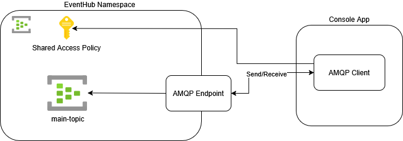
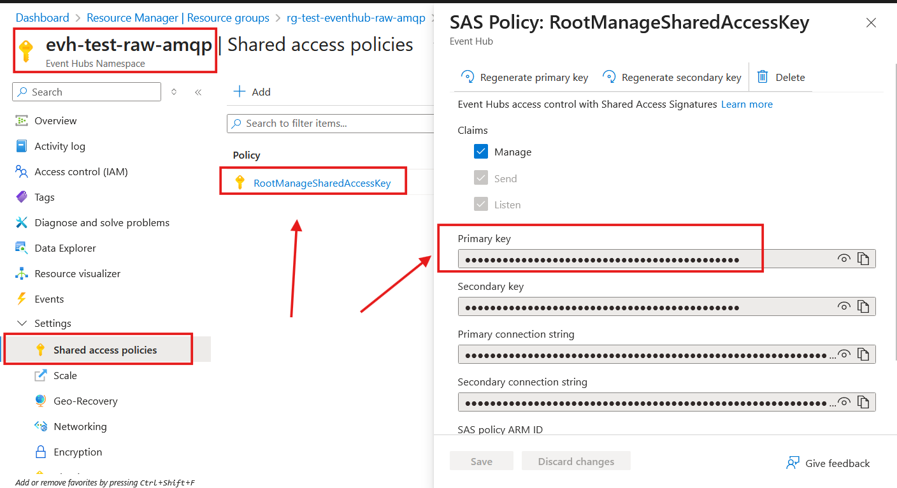
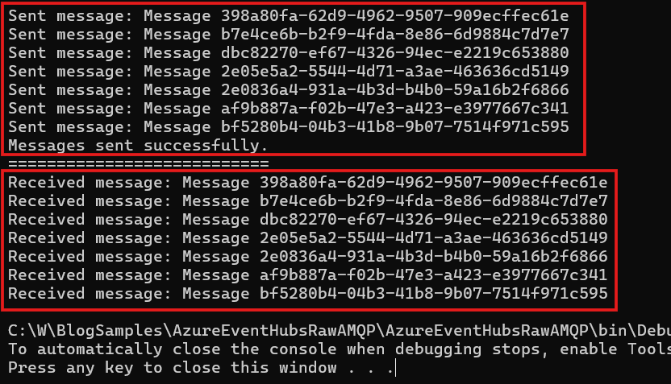

# Azure Event Hubs Raw AMQP Sample

A sample C# console app demonstrating how to use Raw AMQP connection to send and receive messages to/from an Event Hubs partition.

Azure Event Hubs exposes AMQP endpoints, it is possible to interact with event hubs with a low level AMQP client.

Although not interesting in most production cases, this sample demonstrates nonetheless how to use the [`amqpnetlite`](https://github.com/Azure/amqpnetlite) library to interact with Event Hubs via AMQP. 

This example is discussed in [Raw AMQP on Azure Event Hubs](http://blog.techdominator.com/article/raw-amqp-on-azure-event-hubs.html)

## Pre-Requisites
- [Visual Studio 2026](https://visualstudio.microsoft.com/downloads/) or Alternatively [VS Code](https://code.visualstudio.com/) with the [C# Dev Kit Extension](https://marketplace.visualstudio.com/items?itemName=ms-dotnettools.csdevkit)
- [Powershell 7](https://learn.microsoft.com/en-us/powershell/scripting/install/install-powershell?view=powershell-7.5) 
- [Azure CLI](https://learn.microsoft.com/en-us/cli/azure/install-azure-cli?view=azure-cli-latest)
- [Azure Subscription](https://azure.microsoft.com/en-us/pricing/purchase-options/azure-account)
- [Terraform](https://developer.hashicorp.com/terraform/tutorials/azure-get-started/install-cli)

## Setup Overview
The following diagram shows the sample's setup: 



The Console application uses an AMQP Client to send and receive events to the `main-topic` Event Hub.

Connection is made via the AMQP Endpoint of the Event Hub namespace and authentication is done by using the default `RootManageSharedAccessKey` shared access policy.

### Shared Access Policy Key for Event Hubs access

In this sample, to interact with Azure Event Hubs, you need a Shared Access Signature (SAS) key. 

SAS keys are generated based on the shared access policies defined for your Event Hub namespace or specific Event Hubs.

These policies determine the level of access (e.g., send, listen, or manage) granted to the key holder. 

In General, it is recommended to use forms of authentication that does not require providing explicit secrets which **SAS policies are not.**

Learn more about SAS Keys in the [official documentation.](https://learn.microsoft.com/en-us/azure/event-hubs/authenticate-shared-access-signature)

## Console Apps Overview
The console app uses the [`AMQPNetLite.Core`]
(https://www.nuget.org/packages/AMQPNetLite.Core/) nuget package as an AMQP client.

The console app performs the following:
1. Sends a batch of events
1. Receives the events subsequently sent

Respectively in both operations, the console app will establish an dispose of an AMQP connection.

> Note that for production implementation it is recommended to re-use AMQP connections, [usually 1 AMQP connection is sufficient per process.](https://learn.microsoft.com/en-us/azure/service-bus-messaging/service-bus-amqp-protocol-guide#connections-and-sessions)

## How to use
### 1. Create Azure Resources
Azure Resources for this sample can created via the terraform project under `azure-resources`:
1. `cd azure-resources`
2. `terraform init`
3. `terraform apply -var subscription="<AZURE SUBSCRIPTION ID>" -var userPrincipalId="<USER PRINCIPAL ID>"`

Terraform will ask for confirmation before applying the infrastructure resources.

### 2. Setup Console Application
In the `AzureEventHubsRawAMQP` console app, you must setup the SAS Policy key value in the `SasKey` variable:

```csharp
string SasKey = Uri.EscapeDataString("<SAS_POLICY_KEY>");
```

To acquire the event hub namespace's `RootManageSharedAccessKey` via az cli:
```ps1
az login
(az eventhubs namespace authorization-rule keys list `
   --resource-group 'rg-test-eventhub-raw-amqp' `
   --namespace-name 'evh-test-raw-amqp' `
   --name 'RootManageSharedAccessKey' | ConvertFrom-Json).primaryKey | Set-Clipboard
```

The previous will copy the value of the key in your clipboard, you can then replace `<SAS_POLICY_KEY>` by the key value.

You can also aquire the key value from the azure portal by navigating to the Event Hubs Namespace resource > Shared access policies:



### 3. Run The Sample
Run the console app by pressing F5 in Visual Studio

The `AzureEventHubsRawAMQP` console app should display the following output with events received:


## Notes

### Azure Resources Cleanup
After finishing using the sample, remember **to remove the azure resources** to avoid incurring unnecessary costs on your Azure Subscription.

This can be done with Terraform by running:
```bash
terraform destroy -var subscription="<AZURE SUBSCRIPTION ID>" -var userPrincipalId="<USER PRINCIPAL ID>"
```

## Contributing

Please checkout [the contribution guidelines](../CONTRIBUTING.md) for contributing.
