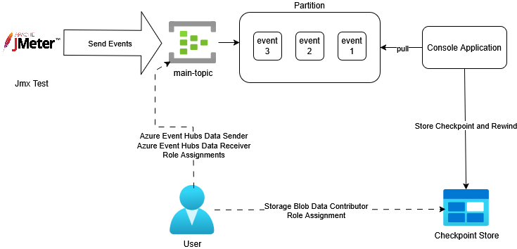
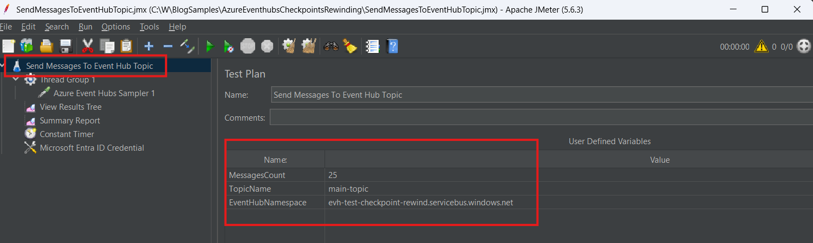
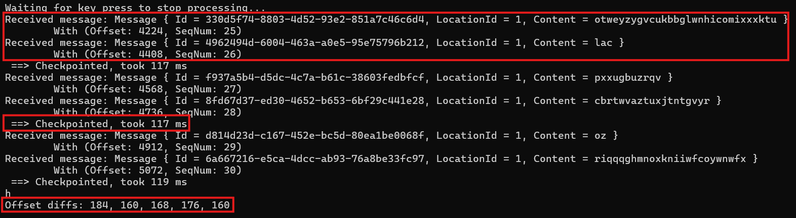

# Azure Event Hub Checkpoints and Rewinding

A sample C# console app demonstrating how to checkpoint and how to rewind the event stream with Azure Event hubs .NET SDK.

In some cases, it can be interesting to reprocess events in an event stream.

This sample demonstrate how can this be safely done via the Event Hubs SDK.

This example is discussed in the [Azure Event Hubs Checkpoints & Rewinding](http://blog.techdominator.com/article/azure-event-hubs-checkpoints-&-rewinding.html) blog post.

## Pre-Requisites
- [Visual Studio 2026](https://visualstudio.microsoft.com/downloads/) or Alternatively [VS Code](https://code.visualstudio.com/) with the [C# Dev Kit Extension](https://marketplace.visualstudio.com/items?itemName=ms-dotnettools.csdevkit)
- [Powershell 7](https://learn.microsoft.com/en-us/powershell/scripting/install/install-powershell?view=powershell-7.5) 
- [Azure CLI](https://learn.microsoft.com/en-us/cli/azure/install-azure-cli?view=azure-cli-latest)
- [Azure Subscription](https://azure.microsoft.com/en-us/pricing/purchase-options/azure-account)

### JMeter
1. [Install a Java Runtime Environment](https://www.oracle.com/java/technologies/downloads/) version [recent enough](https://github.com/pnopjp/jmeter-plugins?tab=readme-ov-file#requirements) for the JMeter Eventhub Plugins (Version 17 at the time of this writing)
1. [Download](https://jmeter.apache.org/download_jmeter.cgi) and [Install JMeter Locally](https://www.simplilearn.com/tutorials/jmeter-tutorial/jmeter-installation)
1. [Install the EventHubs JMeter plugin from pnopjp/jmeter-plugins](https://github.com/pnopjp/jmeter-plugins?tab=readme-ov-file#how-to-install)

## Setup Overview
The following diagram shows the sample's setup:


The `SendMessagesToEventHubTopic.jmx` JMeter test sends a configurable count of messages to the `main-topic` Event Hub.

The Console Application connects to the `main-topic` Event Hub for Consumption, the console app uses the `main-consumer` blob container for checkpoint storage.

The Console Application also implements the capability to rewind the event stream via the `InitializePartitionWithSequenceRewind` method that can be registered on the `PartitionInitializingAsync` event of the `EventProcessorClient` instance. 

A user's principal is assigned the following roles to allow running the sample without using secrets and by using Entra ID Authentication:
- Azure Event Hubs Data Sender on the `main-topic`
- Azure Event Hubs Data Receiver on the `main-topic`
- Storage Blob Data Contributor on the checkpoint store

## Console App Overview

The console app leverages the Event Hubs SDK to consume events and to rewind the stream of events, it performs the following:

1. Create an `EventProcessorClient` instance
1. Register the `ProcessEventHandler` method for event processing
1. Starts Event Consumption
1. Waits for user input to stop consumption
1. Once consumption is stopped, it displays offset diffs between events (this is for showing that offset is not constant and depends on event payload size)

The `ProcessEventHandler` method processes events with the following logic:
1. Deserialize the event payload
1. Store the offset of the received event
1. Displays the message in the console
1. Checkpoints the event consumption every `checkpointThreshold` events (measuring and displaying the checkpoint time in the process)

For event stream rewinding 3 methods are defined:
- `InitializePartitionWithOffsetRewind` performing an offset based rewind
- `InitializePartitionWithSequenceRewind` performing an sequence number based rewind
- `InitializePartitionWithTimestampRewind` performing a time based rewind

## How to use
### 1. Create Azure Resources
The `azure-resources.ps1` powershell script can be used to create the required azure resources:
1. Open a Powershell prompt and `cd AzureEventhubsCheckpointsRewinding`
1. Set the `$userEmail` variable with your azure identity's e-mail
1. Run `az login` to login to the azure subscription
1. Run `./azure-resources.ps1` to create the resources

### 2. Setup JMeter Test 
1. Open JMeter and load the `SendMessagesToEventHubTopic.jmx` test plan.
1. Update the user-defined variables in the test plan with your Event Hub details:
    - `MessagesCount`: Number of messages to send.
    - `TopicName`: Name of your Event Hub topic.
    - `EventHubNamespace`: Your Event Hub namespace.


### 3. Setup Console Application
Under `AzureEventhubsCheckpointsRewinding/Program.cs`, you can configure the checkpoint thresholdwith the `checkpointThreshold` variable, for example if set to 5, the console app will perform a checkpoint every 5 events.

To enable rewind simply register one of the rewinding event handlers on the `PartitionInitializingAsync` event:
```csharp
processor.PartitionInitializingAsync += InitializePartitionWithSequenceRewind;
```
### 4. Run The Sample
To run the sample:
1. Run the console app by pressing F5 in Visual Studio
1. Run the JMeter Test by pressing the Run Button:


The console app should display the following output with self-explanatory statistics:


To perform a rewind simply register one the rewinding events, by doing so you should observe that events are reprocessed even if they have been previously check-pointed.

## Contributing

Please checkout [the contribution guidelines](../CONTRIBUTING.md) for contributing.
