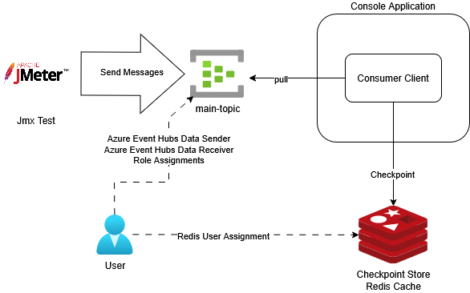
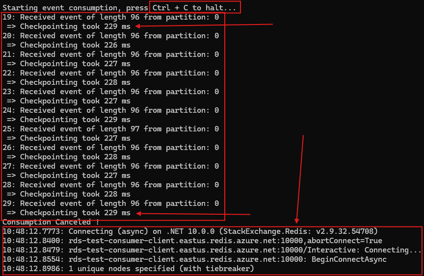

# Azure Event Hub Consumer Client Sample

A sample C# console app demonstrating how to use the `EventHubConsumerClient` to consume events from a partition using the [Event Hubs .NET SDK.](https://learn.microsoft.com/en-us/azure/event-hubs/sdks) 

The `EventHubConsumerClient` offers an alternative way to consume messages with the possibility to customize the checkpoint store and to use something other than a blob container.

This sample demonstrates how we can use a [Redis](https://redis.io/) as a checkpoint store. 

This example is discussed in the [Azure Event Hubs Consumer Client](http://blog.techdominator.com/article/azure-event-hubs-consumer-client.html) blog post. 

## Pre-Requisites
- [Visual Studio 2026](https://visualstudio.microsoft.com/downloads/) or Alternatively [VS Code](https://code.visualstudio.com/) with the [C# Dev Kit Extension](https://marketplace.visualstudio.com/items?itemName=ms-dotnettools.csdevkit)
- [Powershell 7](https://learn.microsoft.com/en-us/powershell/scripting/install/install-powershell?view=powershell-7.5) 
- [Azure CLI](https://learn.microsoft.com/en-us/cli/azure/install-azure-cli?view=azure-cli-latest)
- [Azure Subscription](https://azure.microsoft.com/en-us/pricing/purchase-options/azure-account)
- [Terraform](https://developer.hashicorp.com/terraform/tutorials/azure-get-started/install-cli)

### Redis
- Install [Redis Insights](https://redis.io/insight/) used as a client to interact with the Redis Database

If you would like to run a Redis instance locally:
- On Windows:
    - Install [Docker Desktop](https://www.docker.com/products/docker-desktop/) or Alternatively [Rancher Desktop](https://rancherdesktop.io/)
    - Run a Redis instance [in a container](https://redis.io/docs/latest/operate/oss_and_stack/install/install-stack/docker/)
- On Linux:
    - [Install Docker](https://docs.docker.com/engine/install/) then Run a Redis instance in a container
    - Alternatively you can install Redis [Directly on the linux host](https://redis.io/docs/latest/operate/oss_and_stack/install/archive/install-redis/install-redis-on-linux/)

### JMeter
1. [Install a Java Runtime Environment](https://www.oracle.com/java/technologies/downloads/) version [recent enough](https://github.com/pnopjp/jmeter-plugins?tab=readme-ov-file#requirements) for the JMeter Eventhub Plugins (Version 17 at the time of this writing)
1. [Download](https://jmeter.apache.org/download_jmeter.cgi) and [Install JMeter Locally](https://www.simplilearn.com/tutorials/jmeter-tutorial/jmeter-installation)
1. [Install the EventHubs JMeter plugin from pnopjp/jmeter-plugins](https://github.com/pnopjp/jmeter-plugins?tab=readme-ov-file#how-to-install)

## Setup Overview

The following diagram shows the sample's setup:




The `SendMessagesToEventHubTopic.jmx` JMeter test sends a configurable count of messages to the `main-topic` Event Hub.

The Console Application connects to the `main-topic` Event Hub for Consumption, checkpoint of the event stream is stored in the Redis Instance.

A user's principal is assigned the following roles to allow running the sample without using secrets and by using Entra ID Authentication:
- Azure Event Hubs Data Sender on the `main-topic`
- Azure Event Hubs Data Receiver on the `main-topic`
- Redis Data User on the redis instance

## Console App Overview

The console app leverages the Event Hubs SDK to consume messages and to checkpoint event stream, it performs the following:

1. Create a Redis connection
1. Create an `EventHubConsumerClient`
1. Registers a Ctrl+C event handler to stop the application gracefully
1. Create a `RedisCheckpointStore` used as an abstraction for the redis checkpoint store
1. Determine first partition
1. Initialize start position of the event stream
1. Start event consumption from the first partition, check-pointing every message received

The `RedisCheckpointStore` class is responsible interacting with the Redis Database providing the following operations in its interface:
- Get the last sequence number for a partition
- Set the last sequence number for a partition

## How to use
### 1. Create Azure Resources
Azure Resources for this sample can created via the terraform project under `azure-resources`:
1. `cd azure-resources`
2. `terraform init`
3. `terraform apply -var subscription="<AZURE SUBSCRIPTION ID>" -var userPrincipalId="<USER PRINCIPAL ID>"`

Terraform will ask for confirmation before applying the infrastructure resources.

### 2. Setup JMeter Test 
1. Open JMeter and load the `SendMessagesToEventHubTopic.jmx` test plan.
1. Update the user-defined variables in the test plan with your Event Hub details:
    - `MessagesCount`: Number of messages to send.
    - `TopicName`: Name of your Event Hub topic.
    - `EventHubNamespace`: Your Event Hub namespace.

### 3. Setup Redis Insights
To inspect the content of the redis cache in Azure, you can setup are Redis connection on Redis insights:

First, run the `Get-EntraToken.ps1` powershell script to get your user Id and Token which will be used as username and password for the Redis connection:
```
---
User Principal ID: 8eaed7a7-072c-4fbc-91f1-cd13364bdbea
--- 
Token: eyA0eXAiOiJUVIQiLCXhbGciOi*******
---
```

1. Open Redis Insights and Click 'Add Redis database'


1. In the 'Add Database' pop-up, click on 'Connection Settings':


1. In the General Tab, set the following: Host, Port Username and Password:


1. In the Security Tab, Enable 'Use TLS' then click on 'Add Redis Database':


Once configured you can inspect and change key/values available in the redis cache:


### 4. Setup Console Application
The `AzureEventhubsConsumerClient/Program.cs` is setup by default with resource properties as created by the terraform code under `azure-resources`.

You can easily switch to a local redis instance by commenting out the remote redis `ConfigurationOptions` and uncommenting the local `ConfigurationOptions`

```csharp

...

var redisConnectionLog = new StringWriter();

var configurationOptions = ConfigurationOptions
    .Parse($"127.0.0.1:6379");

//var configurationOptions = ConfigurationOptions
//    .Parse($"rds-test-consumer-client.eastus.redis.azure.net:10000");

...

using var connectionMultiplexer = await ConnectionMultiplexer
    .ConnectAsync(configurationOptions, redisConnectionLog);
```

### 5. Run The Sample
To run the sample:
1. Run the console app by pressing F5 in Visual Studio
1. Run the JMeter Test by pressing the Run Button:


The console app should display the following output with the Redis `ConnectionMultiplexer` output at the end:


The output shows the event processed as well as the check-pointing time.

> Note here that check-pointing time includes network latency since the program is executed from a local machine

## Notes

### Getting an Access Token for Redis

To generate an access token for connecting to Redis, you can use the `Get-EntraToken.ps1` script. 

This script simplifies the process of obtaining an Azure Active Directory (AAD) token, which is necessary for authenticating with Azure Cache for Redis.

By running the script, you can retrieve a token that can be used with tools like [Redis Insights](https://redis.io/insight/) to manage your Redis instance.

Ensure you have logged in to your Azure account using `az login` before executing the script.

### Azure Resources Cleanup
After finishing using the sample, remember **to remove the azure resources** to avoid incurring unnecessary costs on your Azure Subscription.

This can be done with Terraform by running:
```bash
terraform destroy -var subscription="<AZURE SUBSCRIPTION ID>" -var userPrincipalId="<USER PRINCIPAL ID>"
```

## Contributing

Please checkout [the contribution guidelines](../CONTRIBUTING.md) for contributing.
